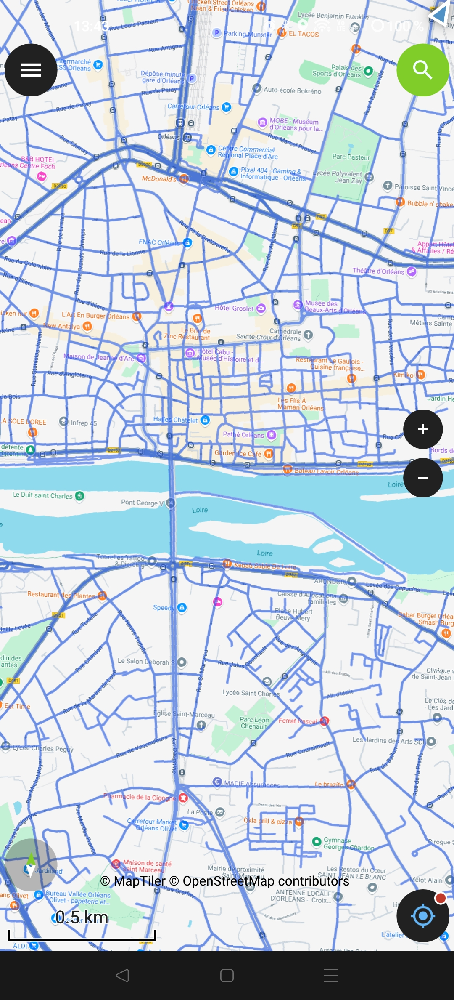
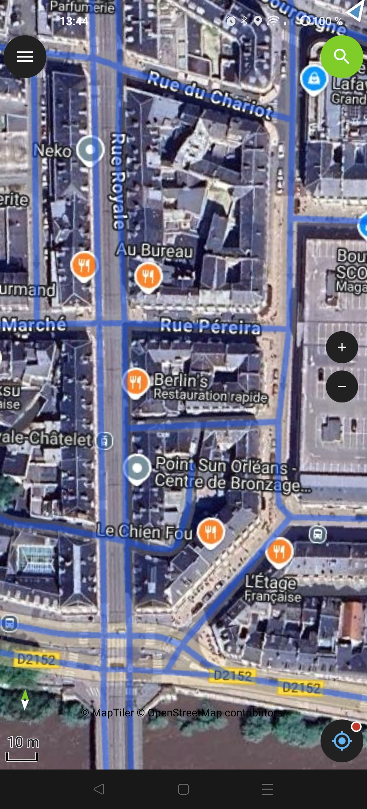
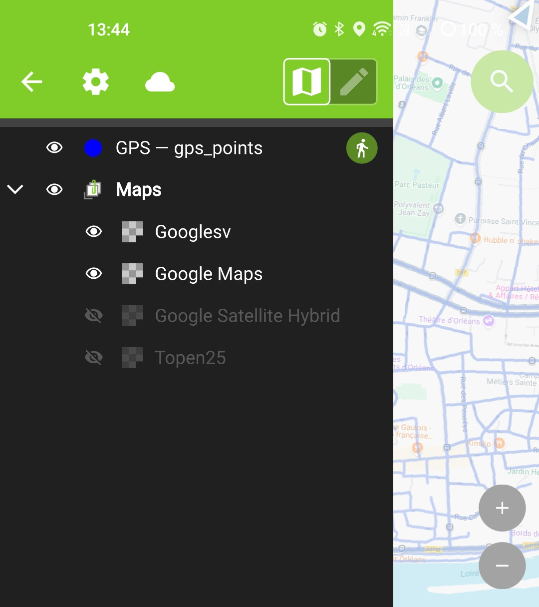
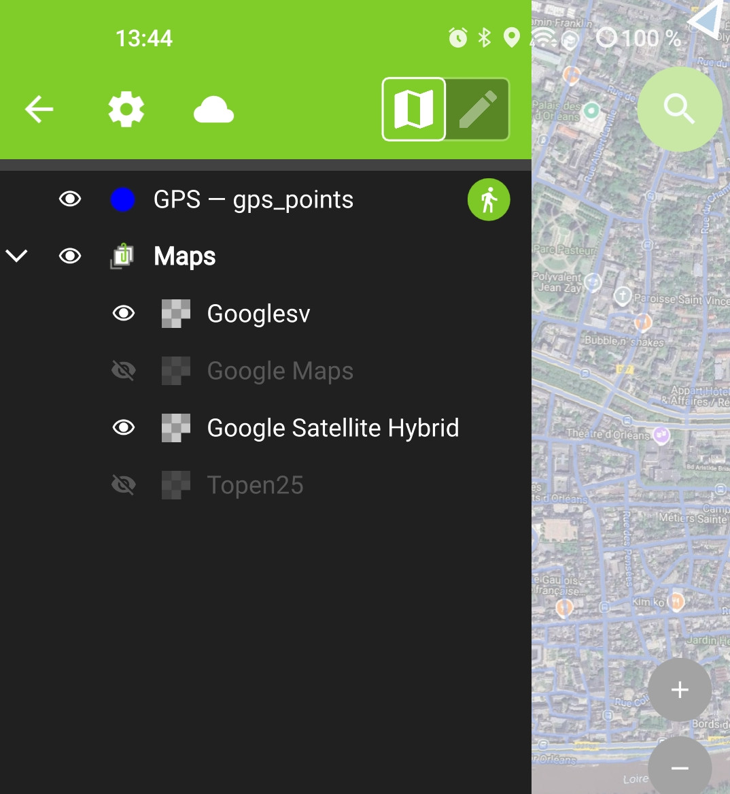

# Google Streetview tools
## Google street view tracking (QGIS Project).
### Streetview street imagery capture aid

This QGIS project gives you a streetview map background on your smartphone (you can choose between standard Maps, hybrid Maps...), with blue lines showing existing routes and areas still to be covered, as well as an overlay of your route covered during the session.
This means you don't have to go back to the same place several times, or to a location you've already captured.

 

possible configurations:

- standard Maps background view
- Hybrid background map view

			-=O=-

## Français
### Aide à la capture d'imagerie de rue Streetview
Ce projet QGIS permet de disposer sur votre smartphone d'un fond de carte streetview (au choix Maps standard, hybride...) avec les lignes bleues des trajets existants et des zones restantes à couvrir ainsi que, en superposition, de votre trajets parcouru pendant la session.

Ainsi cela vous évite de repasser plusieurs fois au même endroit ou sur un lieu déjà capturé.

configurations possibles:

- vue fond de carte Maps standard
- vue fond de carte Hybride

References and links:

