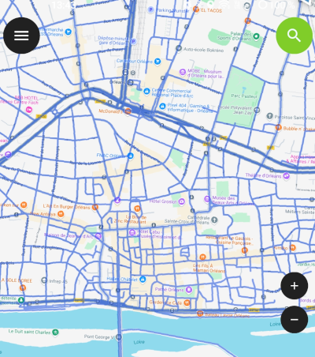
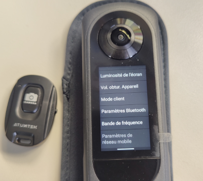
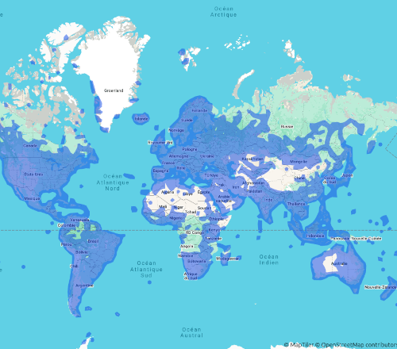

# Google Street View tools

## [QGIS project Google streetview tracking (1)](https://github.com/u4y0u/Google_streetview_tools/blob/main/Google%20Streetview%20tracking.md)
https://github.com/u4y0u/Google_streetview_tools/blob/main/Google%20streetview%20tracking%20v2.zip

## [Using a Bluetooth remote control to control your RICOH Theta X camera](https://github.com/u4y0u/Google_streetview_tools/blob/main/Using%20a%20Bluetooth%20remote%20control%20to%20control%20your%20RICOH%20Theta%20X%20camera.md#using-a-bluetooth-remote-control-to-control-your-ricoh-theta-x-camera)

			-=O=-

1: ‘QGIS project Google streetview tracking’ requires you to load the QField application on your smartphone.

1: "QGIS project Google streetview tracking" necessite de charger l'application QField sur votre smartphone.

site **[QField](https://www.qfield.org/)**

[application APKPure](https://apkpure.com/qfield-for-qgis/ch.opengis.qfield)

[application Playstore](https://play.google.com/store/apps/details?id=ch.opengis.qfield)

[Eric B (u4y0u) on Google Maps](https://www.google.fr/maps/contrib/109641753850297834107/photos/)

